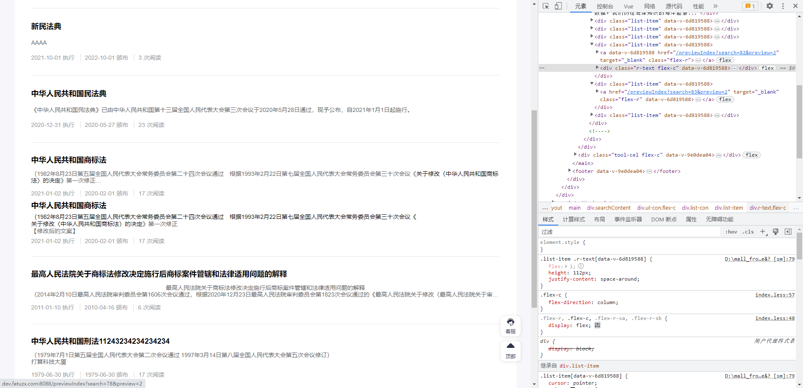

# faq-issue

问题汇总

## nuxt2 开发环境下打开多个页面,导致连接卡死的问题

> 现象  

点击链接打开新页面，打开多个后发现页面一直在加载处于假死状态，但开一个新的浏览器又正常了。发现多个请求一直处于pending，分析原因大概是某个请求阻塞，但请求总数并不超过6，觉得奇怪，检查每个页面还有一个专门用于热更新的长链接 sse 与client

> 解决  

nuxt.config.js build属性下设置loadingScreen: false可以关掉sse，client似乎关闭不了。去掉之后这个阻塞现象没有出现

## nuxt2 开发环境下debugger触发时sourceMap文件不对

> 现象  

浏览器正常进入debugger模式,控制台显示的sourceMap代码文件不一致  
文件夹目录 pages > aBc > index.vue  

> 解决  

检查文件目录发现是因为驼峰命名导致的,将文件夹名称修改成非驼峰的就行  

## nuxt2 移动端返回按钮功能BUG

移动端右上角返回按钮在当前页面历史只有一个的情况下,调用`this.$router.back()`函数执行无响应(例如分享页面的右上角返回功能)

```js
export default function ({ app, store, route, redirect }, inject) {
// 移动端返回按钮
  inject('backPage', () => {
    if (store.state.global.backStart) {
      app.router.push('/mobile')
    } else {
      app.router.go(-1)
    }
    const origin = route.path
    setTimeout(() => {
      store.commit('global/setBackStart', false)
      if (origin === location.pathname) {
        app.router.push({ path: '/mobile' })
      }
    }, 600)
  })
  }
```

解决方案: 自定义客户端插件中添加如上代码,这里通过store中的`backStart`状态控制.当页面只有一个历史页面时,返回上一层就会跳转到首页  
当页面历史记录有多个,而当前页面不是最后一个,这时执行`back()`依然会失效所以添加一个定时器判断页面是否跳转,没有跳则执行跳转首页操作

## nuxt2 v-html 问题

```js
// 数据代码
[{"id":81,"title":"wwww","introduction":"","frontCover":"","collectNums":0,"readNums":3,"createTime":"2022-11-11 04:15:19","time":"104天前","issuedBy":"sdfsdf","issuedDate":"2023-01-09","executeDate":"2023-01-09","levelText":null},{"id":79,"title":"新民法典","introduction":"AAAA","frontCover":"","collectNums":0,"readNums":3,"createTime":"2022-12-14 16:58:05","time":"70天前","issuedBy":"人大常委会","issuedDate":"2022-10-01","executeDate":"2021-10-01","levelText":null},{"id":78,"title":"中华人民共和国民法典","introduction":"《中华人民共和国民法典》已由中华人民共和国第十三届全国人民代表大会第三次会议于2020年5月28日通过，现予公布，自2021年1月1日起施行。","frontCover":"","collectNums":0,"readNums":23,"createTime":"2022-11-11 04:15:19","time":"104天前","issuedBy":"全国人民代表大会","issuedDate":"2020-05-27","executeDate":"2020-12-31","levelText":"宪法"},{"id":82,"title":"中华人民共和国商标法","introduction":"<p>（1982年8月23日第五届全国人民代表大会常务委员会第二十四次会议通过　根据1993年2月22日第七届全国人民代表大会常务委员会第三十次会议《<a class=\"alink\">关于修改〈中华人民共和国<span id=\"cus_2\" class=\"hitClass\">商标法</span>〉的决定</a>》第一次修正</p>\n<p>【修改后的文案】</p>","frontCover":"","collectNums":0,"readNums":17,"createTime":"2023-02-23 14:20:22","time":"2小时前","issuedBy":"全国人民代表大会","issuedDate":"2020-02-01","executeDate":"2021-01-02","levelText":"宪法"},{"id":83,"title":"最高人民法院关于商标法修改决定施行后商标案件管辖和法律适用问题的解释","introduction":"<p style=\"text-align: center;\">最高人民法院关于商标法修改决定施行后商标案件管辖和法律适用问题的解释</p>\n<p>（2014年2月10日最高人民法院审判委员会第1606次会议通过，根据2020年12月23日最高人民法院审判委员会第1823次会议通过的《最高人民法院关于修改〈最高人民法院关于审理侵犯专利权纠纷案件应用法律若干问题的解释（二）〉等十八件知识产权类司法解释的决定》修正）<br>为正确审理商标案件，根据2013年8月30日第十二届全国人民代表大会常务委员会第四次会议《关于修改〈中华人民共和国商标法〉的决定》和重新公布的《中华人民共和国商标法》《中华人民共和国民事诉讼法》和《中华人民共和国行政诉讼法》等法律的规定，就人民法院审理商标案件有关管辖和法律适用等问题，制定本解释。</p>\n<p>新增修改</p>","frontCover":"","collectNums":0,"readNums":6,"createTime":"2023-02-23 14:35:43","time":"1小时前","issuedBy":"全国人民代表大会常务委员会","issuedDate":"2010-04-16","executeDate":"2011-01-10","levelText":null},{"id":76,"title":"中华人民共和国刑法11243234234234234","introduction":"<p>（1979年7月1日第五届全国人民代表大会第二次会议通过 1997年3月14日第八届全国人民代表大会第五次会议修订）</p>\n<p>打算科技大厦</p>","frontCover":"","collectNums":0,"readNums":17,"createTime":"2022-11-11 04:15:19","time":"104天前","issuedBy":"全国人民代表大会","issuedDate":"1979-06-30","executeDate":"1979-06-30","levelText":"法律"}]
```

问题: 服务端生成页面,到客户端出现异常生成数据  


```js
<div
          v-for="(item, index) in listData"
          :key="index.id"
          class="list-item"
        >
          <nuxt-link v-slot="{href}" custom :to="{path: '/previewIndex', query: {search: item.id, preview:searchObj.id }}">
            <a :href="href" target="_blank" class="flex-r">
              
              <div class="r-text flex-c">
                <div class="title">
                  {{ item.title }}
                </div>
                <div class="content tt-overflow">
                  <template v-if="searchObj.value === 'law'">
                    <div v-html="item.introduction" /> // 问题发现处
                  </template>
                  <template v-else>
                    <span class="lead">
                      {{ $formatLead(item.introduction) }}
                    </span>
                  </template>
                </div>
                <div class="botm">
                  <span v-if="searchObj.value === 'law' ">{{ $parseTime(item.executeDate) + ' 执行' }}</span>
                  <span v-if="searchObj.value === 'law' " class="isolation-line">{{ $parseTime(item.issuedDate) + ' 颁布' }}</span>
                  <span v-if="searchObj.value !== 'law' ">{{ $parseTime(item.createTime) }}</span>
                  <span class="isolation-line">{{ item.readNums }} 次阅读</span>
                </div>
              </div>
            </a>
          </nuxt-link>
        </div>
```

> 临时解决办法, 自定义一个v-html指令在客户端渲染数据
